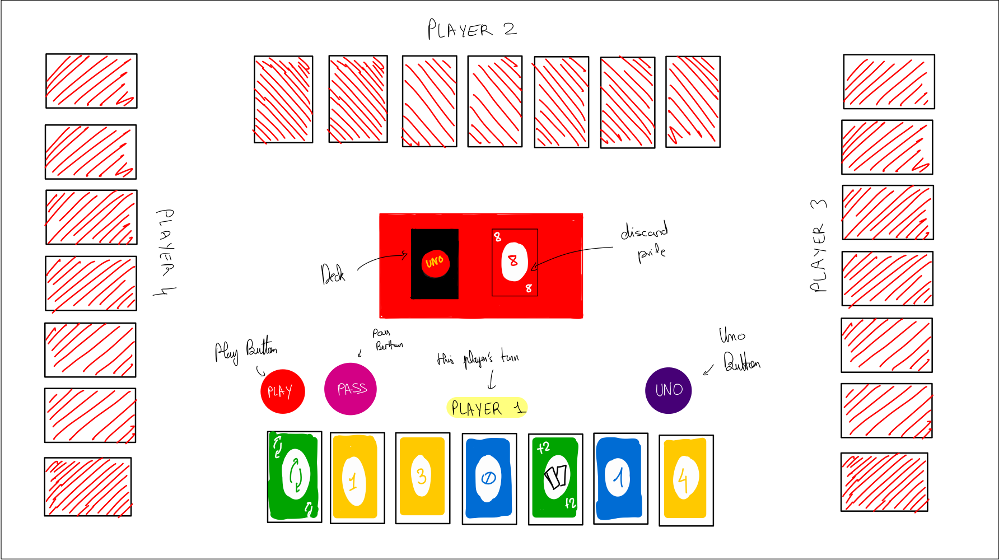
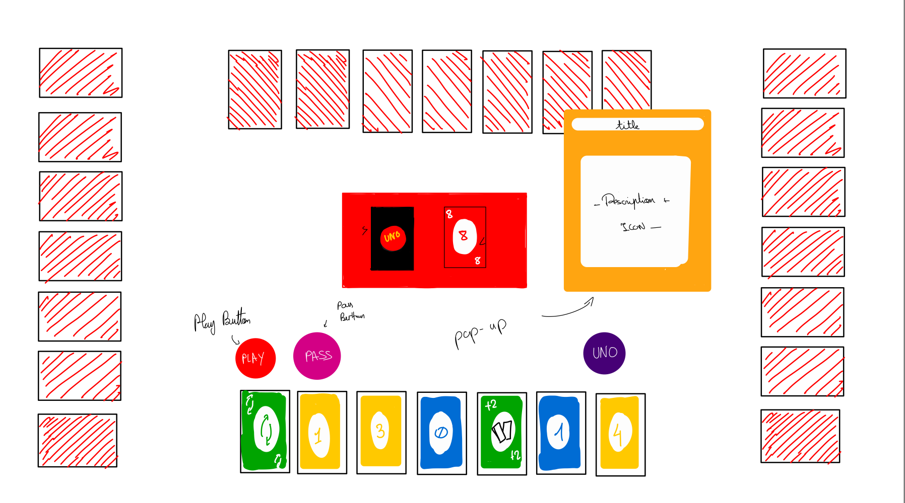

# UNO — Multiplayer Web App

A fully playable, rule-accurate, real-time multiplayer implementation of the UNO card game in the
browser, built in Scala and Scala.js. Originally a team project for EPFL's CS-214 (Software
Construction) course.



## How to play

Each player takes turns playing a card from their hand that matches either the color or symbol of
the top card on the discard pile. Wild cards can be played at any time, letting you choose the
next color. You can also play several cards at once if they share the same symbol. Click the green
button to confirm your selection.

If you can't or don't want to play, draw from the deck and confirm passing your turn (in case you
had a playable card, by clicking the blue button). Special cards — Skip, Reverse, +2, Wild +4, and
the optional advanced rules (0 → rotate all hands, 7 → swap hands) — take effect immediately.

Press the UNO button before playing your second-to-last card to avoid a penalty; forgetting gives
you +2 cards automatically. The game ends when all but one player has emptied their hand, or no
one can make a move — the final ranking is based on who finished first and how many cards everyone
else has left.

## Tech stack & architecture

Scala 3, cross-compiled to both the JVM (server) and Scala.js (browser client), on top of the
course's `webapp-lib` micro-framework, which provides the generic multiplayer session/event loop
and a `View`/`StateView` abstraction so the server controls exactly what each player can see.

| Module | Contents |
|---|---|
| `apps/shared` | `types.scala` — the domain model (colors, cards, hands, draw pile) — and `Wire.scala`, the JSON encode/decode layer shared by client and server |
| `apps/jvm` | `Logic.scala` — the server-side game engine, a pure `(State, Event) => State` transition function — plus its test suite |
| `apps/js` | `CleanUI.scala` — the browser client: renders the current `View` with Scalatags/scalajs-dom and turns clicks into `Event`s sent back to the server |

Card artwork lives under `apps/jvm/src/main/resources/www/static/`; the compiled client JS is a
build artifact and isn't checked in.

## Setup & running

Requirements: a JDK and [sbt](https://www.scala-sbt.org/).

> **Note:** this project depends on `cs214/ul2024/webapp-lib`, a course-internal EPFL GitLab
> repository (declared in `build.sbt`). Building it requires access to `gitlab.epfl.ch` — it won't
> resolve that dependency outside the EPFL network/account.

```bash
sbt
> app/run
```

Then open the printed local URL in a browser. Each browser tab that joins acts as a separate
player (2–4 players).

Run the test suite:

```bash
sbt test
```

## My contribution

This was a 4-person team project. My focus was the front end:

- Built the game's UI (`CleanUI.scala`) — board layout, hand rendering, playable-card
  highlighting, multi-card selection, the color-choice and stacking-penalty pop-ups, the
  end-of-game rankings view, and support for 2–4 players.
- Wired the client UI to the server's game state, keeping the rendered view in sync with the
  `Event`s sent over the wire as players act.
- Helped integration-test and debug the app end-to-end across the full client/server flow, which
  also had me reading and occasionally touching the shared game logic.

### Team

- **Zaynab** — Front-end development
- **Meriem Rahem** — Back-end development
- **Nour Lahouar** — Front-end development
- **Sarra Zghal** — Back-end development
- Everyone — integration testing

## Proposal

This project implements a fully playable, interactive, rule-accurate version of UNO with support
for special rules, stacked +X penalties, multiple-card plays, the UNO button mechanic, and
optional advanced rules (0 → rotate hands, 7 → swap hands). The goal was a responsive,
user-friendly digital experience that stays faithful to classic UNO while adding interactive UI
touches — visual cues and pop-ups that guide decisions and show whose turn it is.

<details>
<summary><strong>User stories</strong></summary>

**Core gameplay**
- As a player, I want to play a card matching the top of the discard pile by color or symbol.
- As a player, I want to play multiple cards at once if they can be stacked in the order I select.
- As a player, I want to deselect a card by tapping it again before confirming my play.
- As a player, I want to draw a card when I can't or don't want to play one.
- As a player, I want to pass my turn if I'd rather not play a valid card, accepting the consequences.

**Special cards**
- As a player, I want a pop-up when playing a Wild (+4) to choose the next color.
- As a player, I want a pop-up when receiving a stacked +X, to accept the penalty or continue
  stacking if I have a matching +2/+4.
- As a player, I want visual feedback when a Skip or Reverse is played.
- As a player, I want the optional advanced rules available: 0 → rotate all hands, 7 → swap hands
  with a chosen player.

**UNO button mechanic**
- As a player, I want to press UNO before playing my second-to-last card to avoid a penalty, and
  to be penalized automatically (+2 cards) if I forget.

**Game flow**
- As a player, I want the game to detect automatically when a player finishes, the deck empties,
  or no one can play, and to show the final ranking (by finish order, then cards remaining).

**UI**
- As a player, I want playable cards highlighted, selected cards visually distinguished, pop-ups
  for color/stacking decisions, and a clear animation for "skip" effects.

</details>

<details>
<summary><strong>Requirements</strong></summary>

**Gameplay logic**
- A card can be played if it matches the color or symbol of the top discard card; Wild cards can
  always be played.
- Multiple cards can be played at once only if they chain by color or by symbol (e.g. 🟥6 → 🟨6 →
  🟦6 is valid; 🟥6 → 🟥8 is not).
- A player who can't/won't play may draw once from the deck.
- Special card effects (Reverse, Skip, +2, Wild, Wild +4) are enforced by the engine.
- When targeted by a stacked +X effect, a player with a matching +2/+4 can choose to draw the
  accumulated total or continue the chain; otherwise they're forced to draw. No other card may be
  played during a stacking sequence.
- Missing a UNO declaration at 1 card is detected and penalized; emptying your hand wins.

**Turn & rule management**
- Turn order (including Reverse) is tracked and enforced; illegal moves are rejected.

**Game state & UI**
- The UI shows the current hand, the discard pile's top card, and everyone else's card counts.
- Pass, play, and draw actions are all exposed, along with the pop-ups above.
- A new game can always be started from a clean state.

**Non-functional**
- Easy to pick up for anyone who knows UNO; responsive with immediate visual feedback; robust
  against invalid states; deterministic and reproducible rules.

</details>

## Mockups



