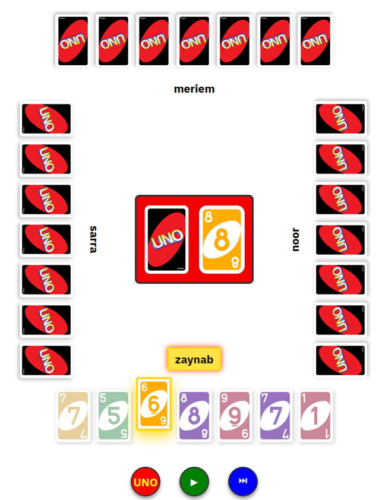
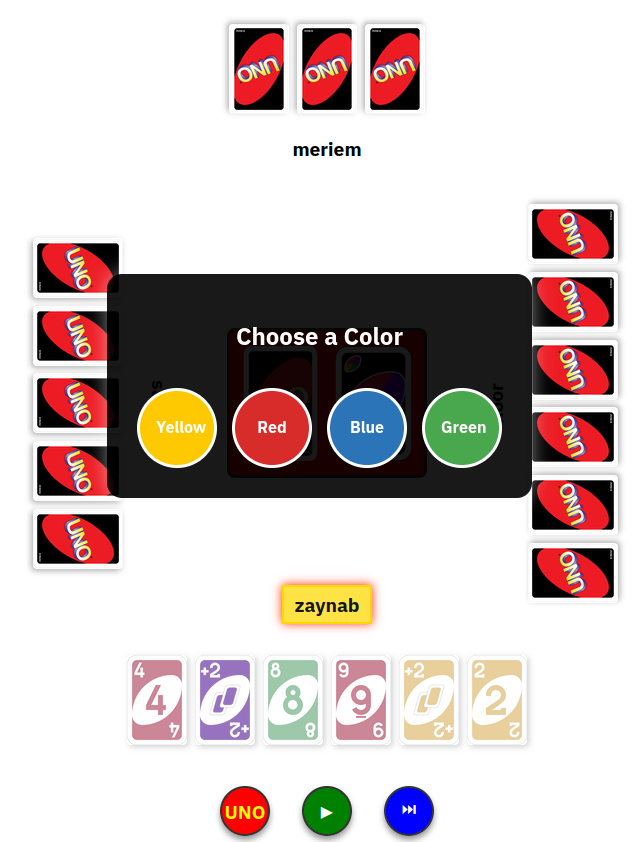

# UNO — Multiplayer Web App

A fully playable, rule-accurate, real-time multiplayer implementation of the UNO card game in the
browser, built in Scala and Scala.js. Originally a team project for EPFL's CS-214 (Software
Construction) course.




## How to play

Each player takes turns playing a card from their hand that matches either the color or symbol of
the top card on the discard pile. Wild cards can be played at any time, letting you choose the
next color. You can also play several cards at once if they share the same symbol. Click the green
button to confirm your selection.

If you can't or don't want to play, draw from the deck and confirm passing your turn (in case you
had a playable card, by clicking the blue button). Special cards — Skip, Reverse, +2, Wild +4, and
0 → rotate all hands — take effect immediately.

Press the UNO button before playing your second-to-last card to avoid a penalty; forgetting gives
you +2 cards automatically. The game ends when all but one player has emptied their hand, or no
one can make a move — the final ranking is based on who finished last.

## Tech stack & architecture

Scala 3, cross-compiled to both the JVM (server) and Scala.js (browser client), on top of the
course's `webapp-lib` micro-framework, which provides the generic multiplayer session/event loop
and a `View`/`StateView` abstraction so the server controls exactly what each player can see.

| Module | Contents |
|---|---|
| `apps/shared` | `types.scala` — the domain model (colors, cards, hands, draw pile) — and `Wire.scala`, the JSON encode/decode layer shared by client and server |
| `apps/jvm` | `Logic.scala` — the server-side game engine, a pure `(State, Event) => State` transition function — plus its test suite |
| `apps/js` | `CleanUI.scala` — the browser client: renders the current `View` with Scalatags/scalajs-dom and turns clicks into `Event`s sent back to the server |

Card artwork lives under `apps/jvm/src/main/resources/www/static/`.

## Setup & running

Requirements: a JDK and [sbt](https://www.scala-sbt.org/).

> **Note:** this project depends on `cs214/ul2024/webapp-lib`, a course-internal EPFL GitLab
> repository (declared in `build.sbt`). Building it requires access to `gitlab.epfl.ch` — it won't
> resolve that dependency outside the EPFL network/account.

```bash
sbt
> run
```

Then open the printed local URL in a browser. Each browser tab that joins acts as a separate
player (2–4 players).

Run the test suite:

```bash
sbt test
```

## My contribution

This was a 4-person team project. My focus was the front end:

- Built the game's UI (`CleanUI.scala`) — board layout, hand rendering, playable-card
  highlighting, multi-card selection, the color-choice and stacking-penalty pop-ups, the
  end-of-game rankings view, and support for 2–4 players.
- Wired the client UI to the server's game state, keeping the rendered view in sync with the
  `Event`s sent over the wire as players act.
- Helped integration-test and debug the app end-to-end across the full client/server flow, which
  also had me reading and occasionally touching the shared game logic.

### Team

- **Zineb El Baakili** — Front-end development
- **Meriem Rahem** — Back-end development
- **Nour Lahouar** — Front-end development
- **Sarra Zghal** — Back-end development
- Everyone — integration testing

